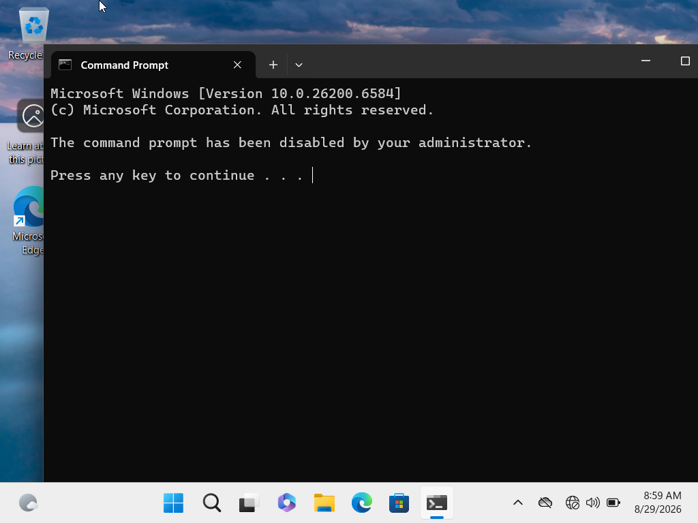
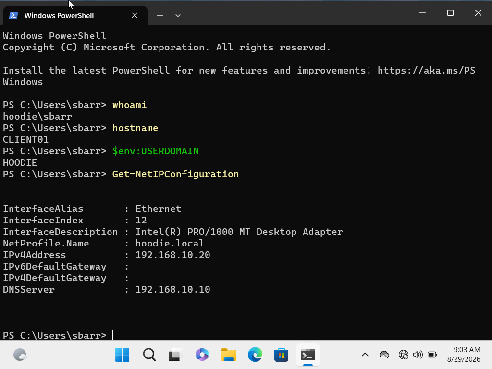
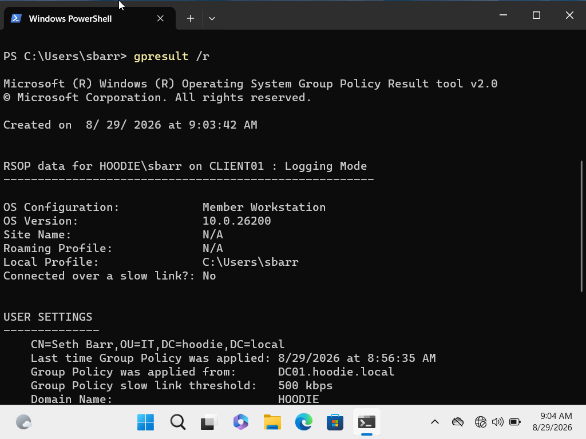
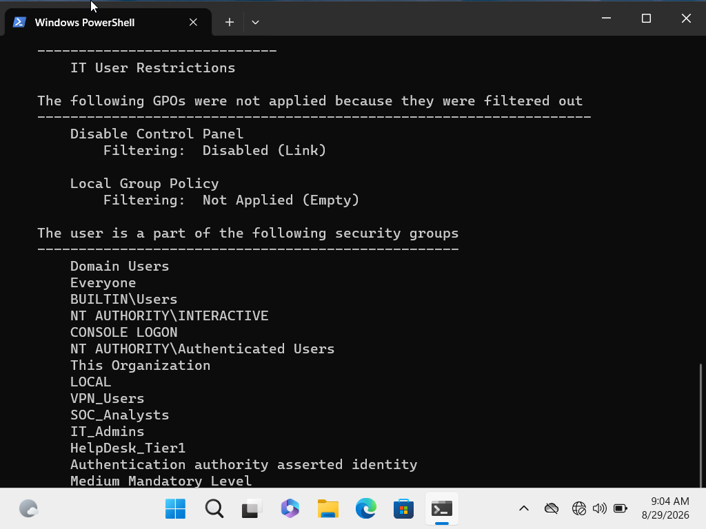
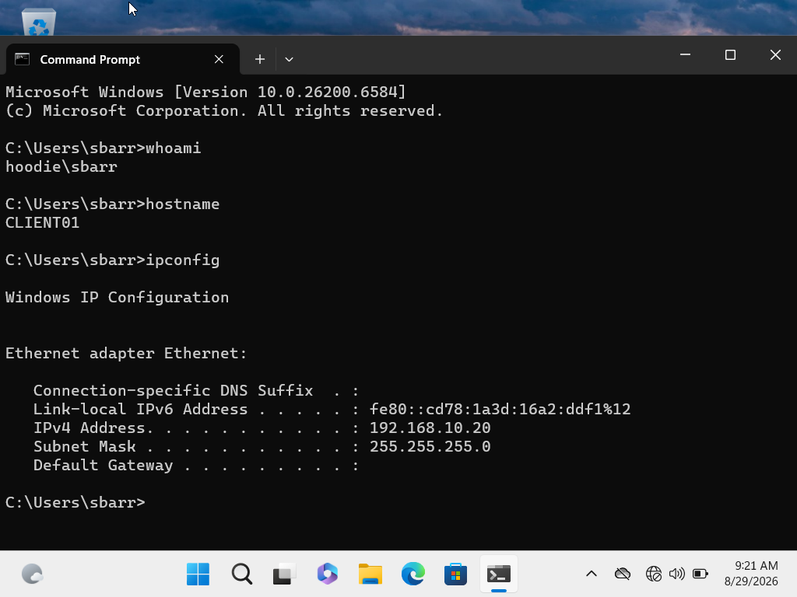

# INC-001: Command Prompt Disabled by Group Policy

## Ticket Information

- Category: Windows / Group Policy
- Priority: Medium
- Device: CLIENT01
- Domain: hoodie.local
- Status: Resolved

## Reported Issue

A domain user was unable to access Windows Command Prompt on CLIENT01.

When Command Prompt was launched, Windows displayed:

"The command prompt has been disabled by your administrator."

## Initial Assessment

PowerShell remained accessible while Command Prompt was blocked. This suggested that the issue was likely caused by a configuration or policy restriction rather than a general operating system failure.

## Troubleshooting

I opened PowerShell and verified the affected account and workstation:

```powershell
whoami
hostname
```

I then reviewed the workstation's network configuration:

```powershell
Get-NetIPConfiguration
```

CLIENT01 was configured with:

- IPv4 address: 192.168.10.20
- DNS server: 192.168.10.10
- Domain: hoodie.local

I reviewed the Group Policy configuration with:

```powershell
gpresult /r
```

The results confirmed that Group Policy was being received from `DC01.hoodie.local`.

The results also showed that the `IT User Restrictions` GPO was applied to the affected user.

I opened Group Policy Management on DC01 and inspected the following policy path:

`User Configuration > Policies > Administrative Templates > System > Prevent access to the command prompt`

The policy was configured as `Enabled`.

## Root Cause

The `IT User Restrictions` Group Policy Object had the `Prevent access to the command prompt` policy enabled.

Because the GPO applied to the affected domain user, Windows prevented the user from accessing Command Prompt.

## Resolution

On DC01, I changed:

`Prevent access to the command prompt`

from:

`Enabled`

to:

`Not Configured`

I then returned to CLIENT01 and refreshed Group Policy:

```powershell
gpupdate /force
```

## Validation

After the Group Policy refresh completed, I reopened Command Prompt on CLIENT01.

Command Prompt opened successfully.

I verified functionality by running:

```cmd
whoami
hostname
ipconfig
```

The results confirmed:

- Domain account: HOODIE\sbarr
- Workstation: CLIENT01
- IPv4 address: 192.168.10.20

Command Prompt access was successfully restored.

## Evidence

### 1. Command Prompt Blocked

The initial issue showed that Command Prompt had been disabled by an administrator.



### 2. PowerShell and Network Investigation

PowerShell remained available and was used to verify the user, workstation, IP configuration, and DNS configuration.



### 3. Group Policy Investigation

`gpresult /r` confirmed domain Group Policy processing and identified the user's domain configuration.



Additional Group Policy results showed the policies and security groups associated with the affected user.



### 4. Resolution Validation

After modifying the GPO and refreshing Group Policy, Command Prompt opened successfully and normal command execution was restored.



## Skills Demonstrated

- Windows 11 troubleshooting
- Windows Server 2022 administration
- Active Directory
- Group Policy troubleshooting
- PowerShell
- Windows command-line utilities
- TCP/IP configuration review
- DNS configuration review
- Root cause analysis
- Technical documentation
- Post-resolution validation

## Outcome

The issue was traced to an applied Group Policy restriction rather than a workstation, network, or user authentication failure.

The restrictive policy was corrected, Group Policy was refreshed, and Command Prompt functionality was successfully restored on CLIENT01.

Status: Resolved
