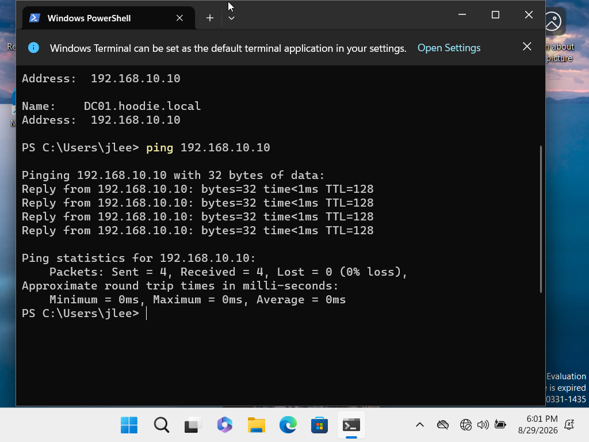
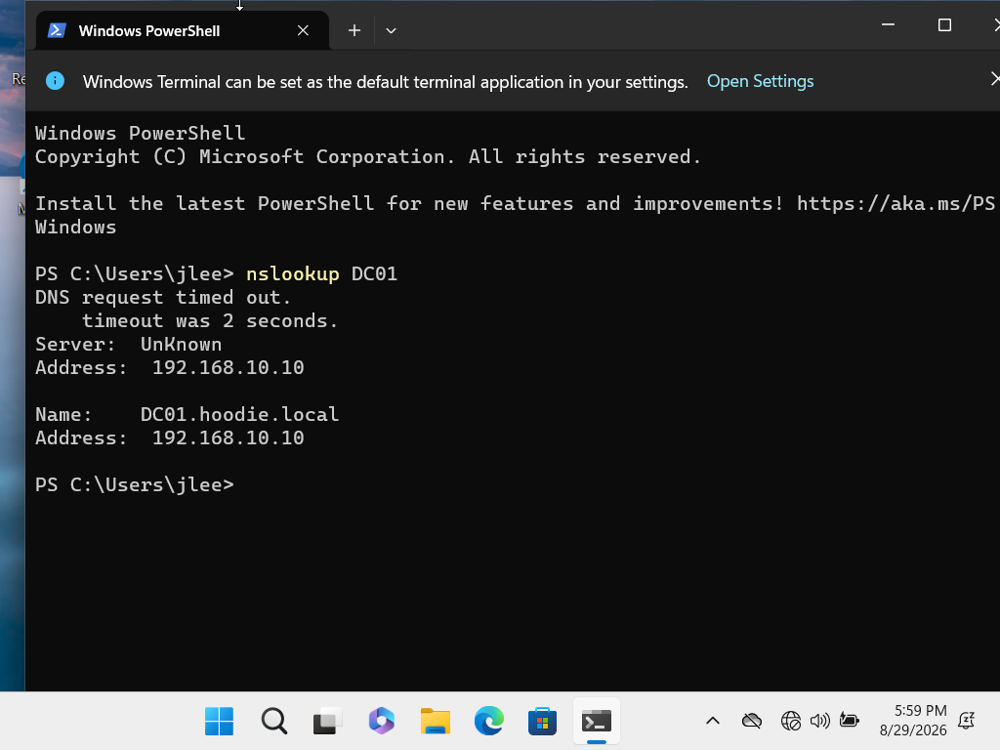
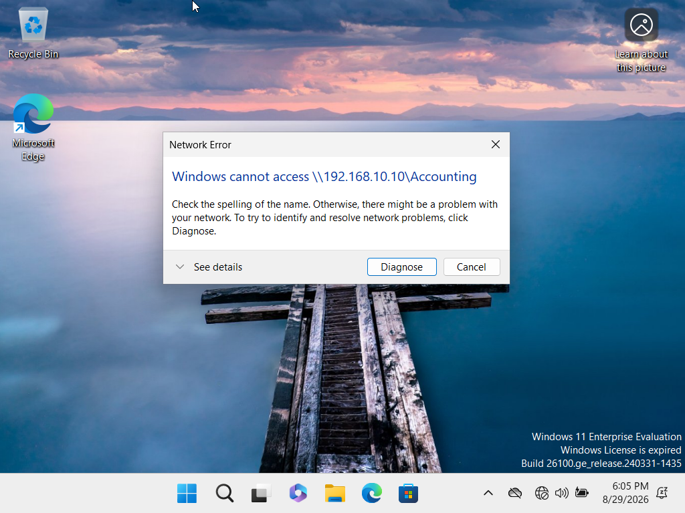
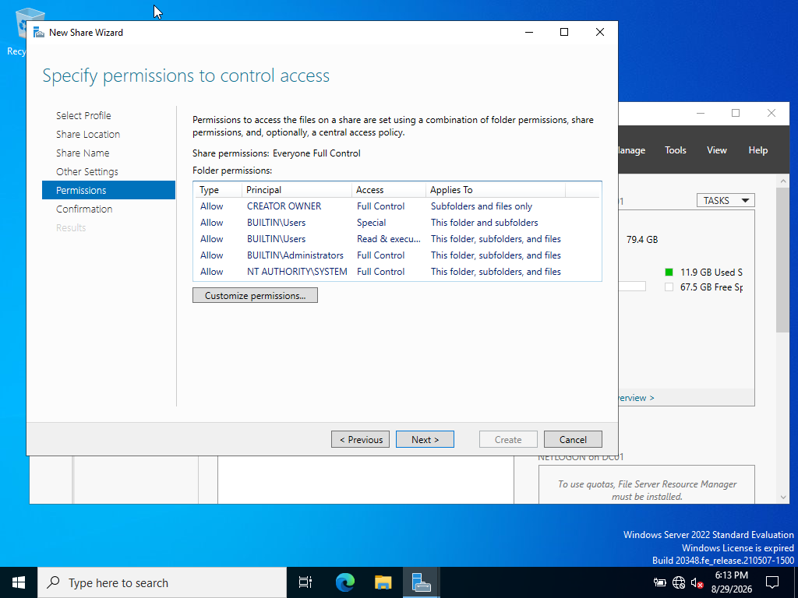
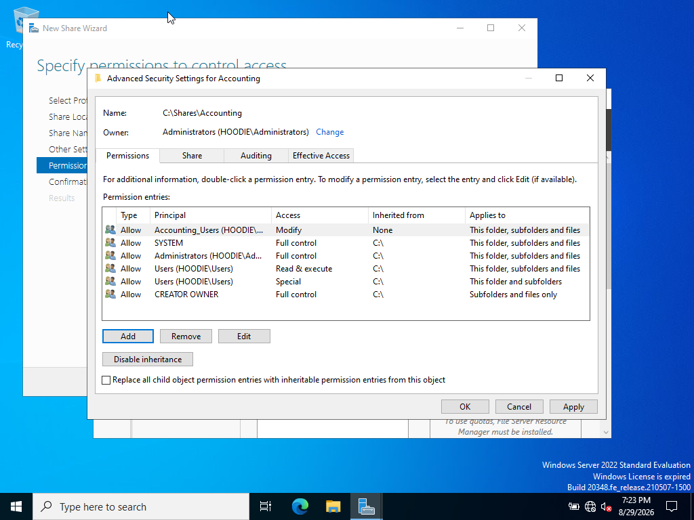
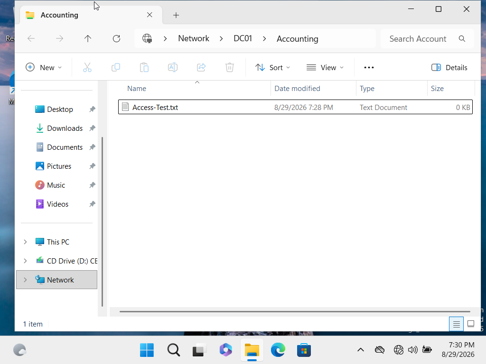

# INC-003: Accounting Network Share Unavailable

## Ticket Information

- Category: Network / File Sharing
- Priority: Medium
- User: Jordan Lee
- Department: Accounting
- Device: CLIENT01
- Server: DC01
- Domain: hoodie.local
- Status: Resolved

## Reported Issue

A domain user reported being unable to access an internal Accounting resource from CLIENT01.

The user confirmed that general internet access and external websites were working normally, indicating that the workstation had network connectivity.

The expected internal resource was:

\\DC01\Accounting

## Initial Assessment

Because general internet access was working while the internal resource was unavailable, I narrowed troubleshooting to the connection between CLIENT01 and the internal server.

I avoided making immediate changes to DNS, Active Directory, permissions, or network configuration until the failure could be isolated.

## Troubleshooting

I first reviewed the workstation's network configuration using:

ipconfig

CLIENT01 had the expected IPv4 configuration.

I then attempted to reach DC01 by hostname.

The initial hostname test indicated a name resolution issue, so I queried DNS directly using:

nslookup DC01

The DNS query ultimately resolved:

DC01.hoodie.local

to:

192.168.10.10

Although the query initially displayed a DNS request timeout, the server record was successfully returned.

I then tested direct IP connectivity to DC01:

ping 192.168.10.10

DC01 responded successfully to all four ICMP echo requests with 0 percent packet loss.

This confirmed basic IP connectivity between CLIENT01 and DC01.

Because the server was reachable, I tested the expected SMB resource directly by IP:

\\192.168.10.10\Accounting

Windows returned an error stating that it could not access the Accounting path.

At this point, network connectivity to DC01 had been verified, but the expected SMB resource remained unavailable.

I investigated the file sharing configuration on DC01 using Server Manager and discovered that an Accounting SMB share did not exist.

## Root Cause

The expected Accounting SMB share had not been created on DC01.

CLIENT01 could successfully communicate with DC01 at the network layer, but the requested Accounting resource was unavailable because there was no corresponding SMB share for Windows to access.

The primary root cause was therefore a missing server-side resource rather than a general network connectivity failure.

## Resolution

I created the following folder on DC01:

C:\Shares\Accounting

I then used the New Share Wizard in Server Manager to configure an SMB share named:

Accounting

This established the UNC path:

\\DC01\Accounting

During configuration, I reviewed the initial share and folder permissions before assigning departmental access.

Rather than granting permissions directly to an individual user, I created an Active Directory security group named:

Accounting_Users

The group was configured as:

- Group scope: Global
- Group type: Security

Jordan Lee was added as a member of Accounting_Users.

I then assigned the Accounting_Users group Modify permissions to:

C:\Shares\Accounting

The permissions applied to:

This folder, subfolders and files

Modify access allowed authorized Accounting users to read, create, modify, and delete files without granting unnecessary Full Control permissions.

Because Jordan Lee had been added to a new security group while already signed in, I signed the user out of CLIENT01 and signed back in so Windows would generate a new logon token containing the updated group membership.

## Validation

After signing back into CLIENT01, I accessed:

\\DC01\Accounting

The Accounting share opened successfully.

To verify that the user had functional write access rather than simply being able to view the folder, I created:

Access-Test.txt

inside the Accounting share.

The file was created successfully.

This validated:

- CLIENT01 could communicate with DC01.
- DC01 was accessible through the network.
- The Accounting SMB share was available.
- Jordan Lee could access the departmental resource.
- Accounting_Users group membership was effective.
- Modify permissions allowed file creation.
- The original user issue was resolved.

## Skills Demonstrated

- Windows 11 troubleshooting
- Windows Server 2022 administration
- TCP/IP troubleshooting
- DNS troubleshooting
- ICMP connectivity testing
- SMB file sharing
- UNC path troubleshooting
- Server Manager
- Active Directory Users and Computers
- Active Directory security groups
- Group-based access control
- NTFS permissions
- File share permissions
- Least-privilege access concepts
- Root cause analysis
- End-user troubleshooting
- Technical documentation
- Post-resolution validation

## Troubleshooting Logic

The incident was resolved using a layered troubleshooting approach.

General internet access was verified first to establish that CLIENT01 was not experiencing a complete network outage.

DNS resolution was then tested to determine whether CLIENT01 could resolve DC01.

Direct IP connectivity was tested separately to determine whether CLIENT01 could communicate with DC01 independently of hostname resolution.

The SMB path was then tested directly, which demonstrated that the expected internal resource remained unavailable despite successful server connectivity.

Server-side investigation identified that the Accounting share did not exist.

The missing resource was created and access was assigned through an Active Directory security group rather than directly to an individual user.

Finally, the user's logon token was refreshed and both share access and file creation were tested successfully.

## Outcome

The user's inability to access the Accounting resource was traced to a missing SMB share on DC01 rather than a workstation or general network connectivity failure.

The Accounting share was created, departmental access was assigned through the Accounting_Users Active Directory security group, and Modify permissions were configured for the shared folder.

After refreshing the user's logon session, Jordan Lee successfully accessed \\DC01\Accounting and created Access-Test.txt.

Status: Resolved
