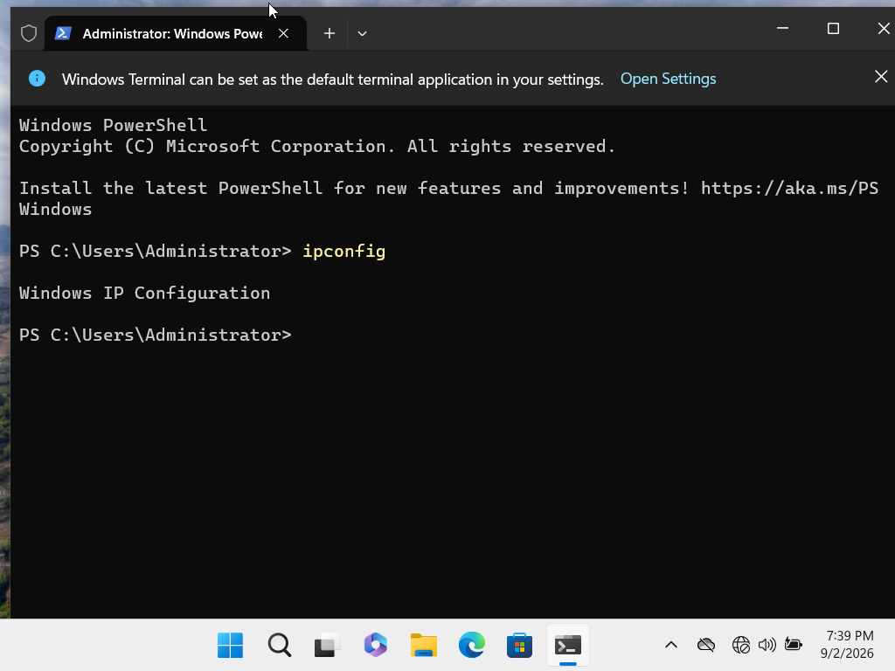
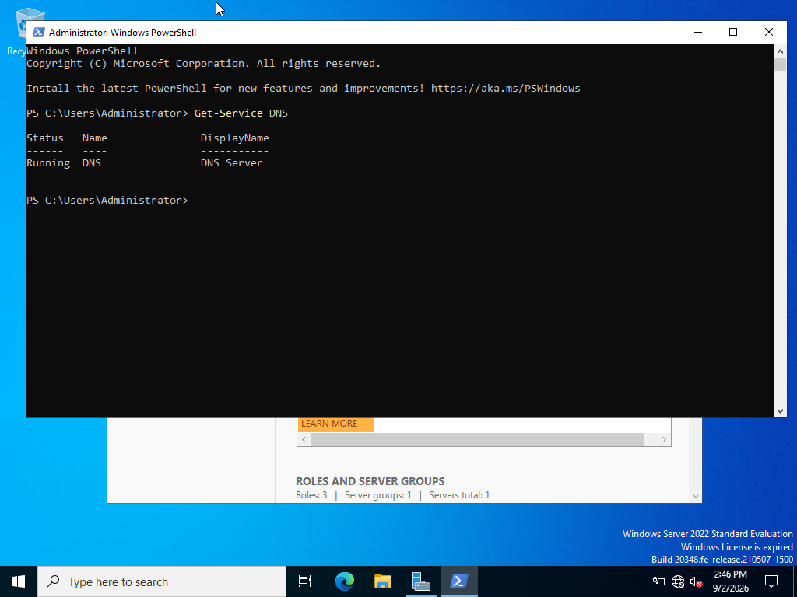
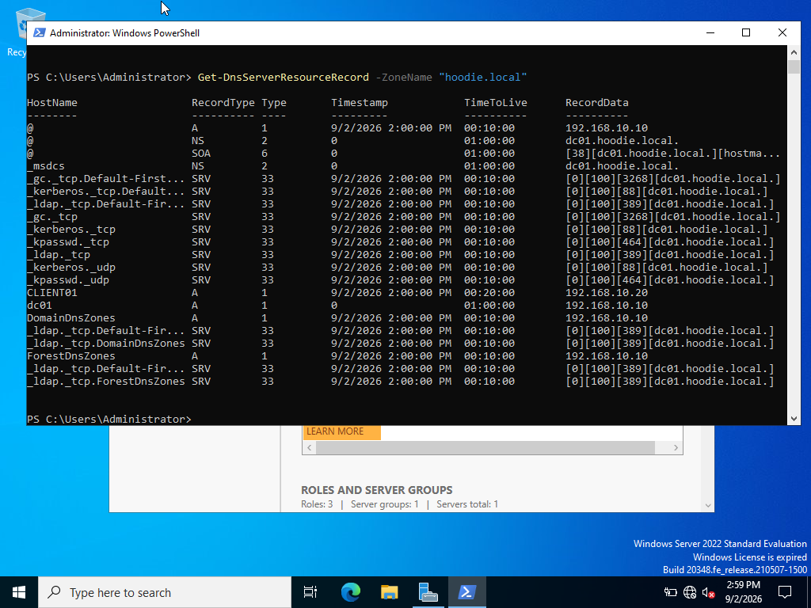
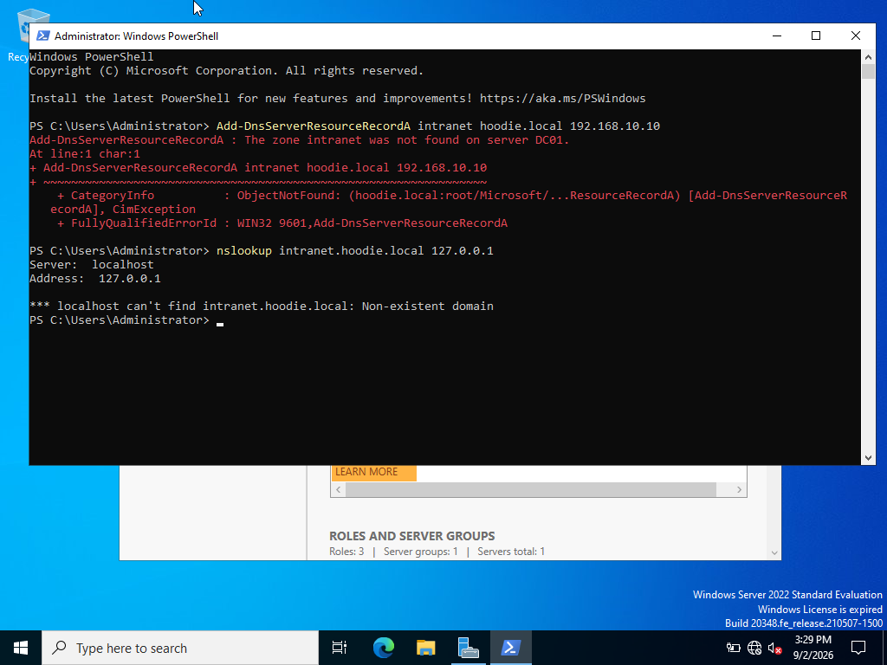
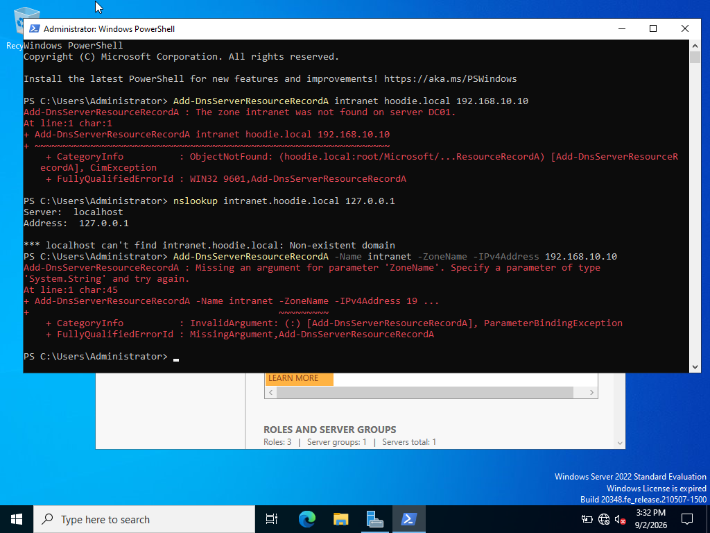
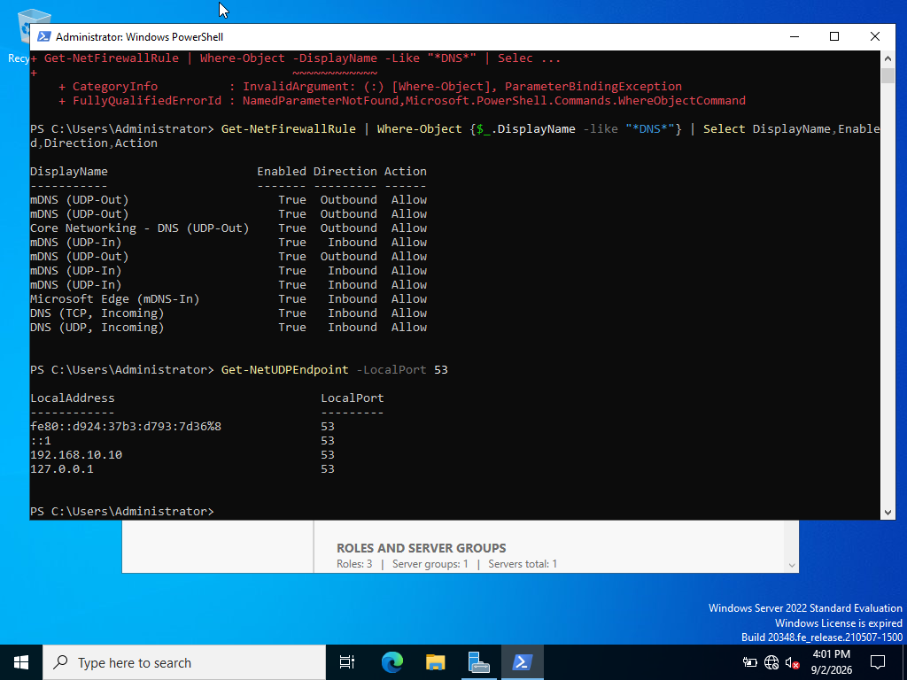
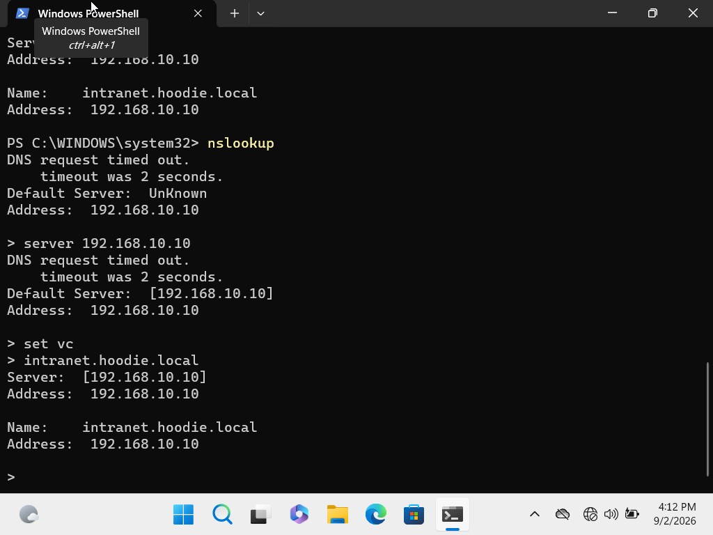
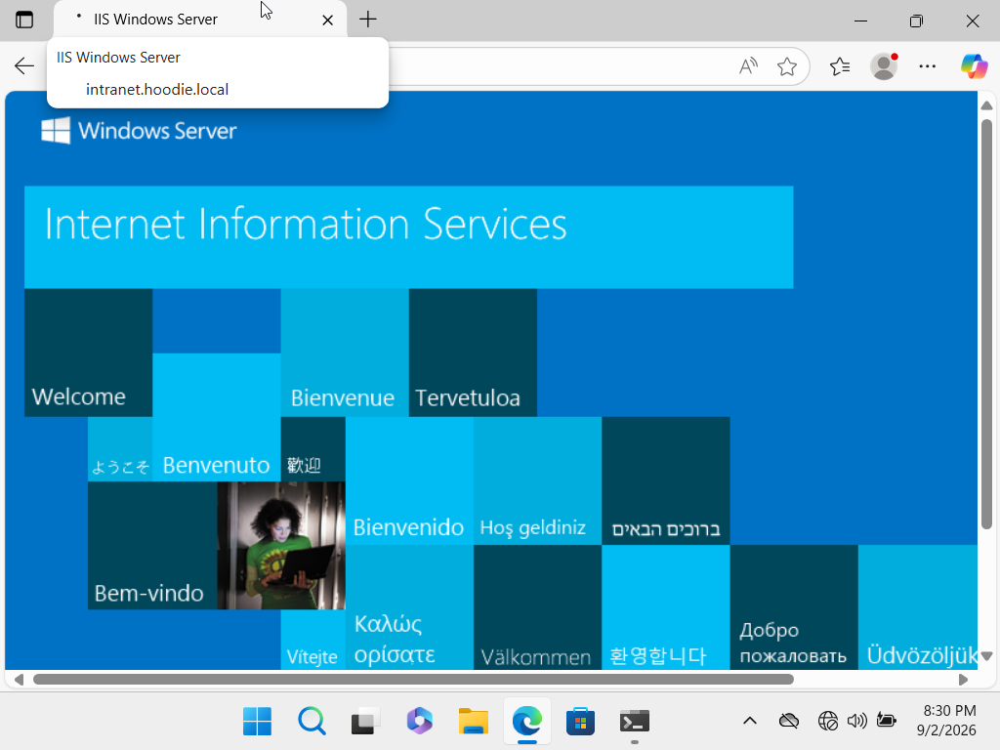

# INC-004: Internal Intranet Name Resolution and Web Service Failure

## Incident Summary

- Incident ID: INC-004
- Priority: Medium
- Category: DNS / Network Services / Web Services
- User: Jordan Lee
- Department: Accounting
- Client: CLIENT01
- Server: DC01
- Domain: hoodie.local
- DNS Server: 192.168.10.10
- Intranet Hostname: intranet.hoodie.local
- Status: Resolved

## User Report

The user could sign in to CLIENT01 but was unable to access the internal intranet service by hostname. Initial testing indicated that the client was configured to use the domain controller at 192.168.10.10 as its DNS server, but DNS queries produced inconsistent timeout behavior.

The incident was investigated from the client, network, DNS server, packet, and application-service layers.

## Environment

CLIENT01:
- Windows 11 Enterprise
- Domain joined to hoodie.local
- IPv4 address: 192.168.10.20
- DNS server: 192.168.10.10

DC01:
- Windows Server 2022
- Active Directory Domain Services
- DNS Server
- IPv4 address: 192.168.10.10
- IIS installed during remediation

Virtualization:
- Oracle VirtualBox
- CLIENT01 and DC01 connected through the LABNET Internal Network

## Troubleshooting

### 1. Verified CLIENT01 Network Configuration

The client network configuration was reviewed to confirm the workstation's IP address, DNS configuration, and domain suffix.

CLIENT01 was configured with:
- IPv4: 192.168.10.20
- DNS server: 192.168.10.10
- Primary DNS suffix: hoodie.local

Evidence:

### 2. Reproduced the DNS Symptom

DNS testing from CLIENT01 produced timeout behavior when querying the domain DNS server.

This established the reported symptom and provided a baseline before remediation.

Evidence:

### 3. Verified the DNS Service and Zone on DC01

The DNS Server service on DC01 was confirmed to be running.

The hoodie.local DNS zone was inspected on DC01 to verify that the authoritative zone existed and contained the expected Active Directory DNS records.

Evidence:

### 4. Inspected DNS Resource Records

The hoodie.local resource records were reviewed to determine whether the requested intranet hostname existed.

The required intranet host record was not initially available for the intended internal service.

Evidence:

### 5. Created the Intranet DNS A Record

An IPv4 host record was created for the internal intranet service:

- Host: intranet
- FQDN: intranet.hoodie.local
- IPv4 address: 192.168.10.10

An initial PowerShell attempt used incorrect command syntax. The command was corrected and the A record was successfully created.

The record was then validated locally on DC01 and resolved to 192.168.10.10.

Evidence:

### 6. Verified DNS Transport and Server Listening State

Because CLIENT01 continued to display unusual nslookup timeout behavior, troubleshooting continued below the DNS record layer.

DC01 was confirmed to be listening on UDP port 53 at 192.168.10.10.

Firewall rules for inbound DNS traffic were also verified as enabled.

Evidence:

### 7. Investigated Client DNS Behavior

CLIENT01 continued to display timeout behavior in nslookup even after the DNS record was created and could be resolved locally on DC01.

Additional testing confirmed that basic IP connectivity between CLIENT01 and DC01 was operational.

Evidence:

### 8. Captured DNS Traffic at the Virtual NIC

Because CLIENT01 and DC01 communicate through a VirtualBox Internal Network, host-level packet capture did not provide visibility into the guest-to-guest traffic.

VirtualBox NIC tracing was enabled for CLIENT01 and a packet capture was collected.

Packet capture:

packet-captures/client01-dns-troubleshooting.pcap

Analysis of the capture showed a DNS A-record query from:

192.168.10.20 -> 192.168.10.10:53

for:

intranet.hoodie.local

The capture also showed DC01 returning a valid DNS response to CLIENT01 containing:

intranet.hoodie.local -> 192.168.10.10

This demonstrated that UDP DNS traffic was successfully traveling in both directions and that the DNS server returned the expected A record.

The packet evidence ruled out a VirtualBox network-path failure and a simple UDP/53 firewall block.

### 9. Validated Windows Name Resolution

The Windows client resolver was tested independently of the unusual nslookup behavior.

CLIENT01 successfully resolved:

intranet.hoodie.local -> 192.168.10.10

using the normal Windows networking stack.

This confirmed that internal hostname resolution was functioning after the DNS record was created.

### 10. Tested the Application Layer

After DNS resolution was restored, accessing:

http://intranet.hoodie.local

did not successfully load a webpage.

TCP port 80 was tested from CLIENT01 and was initially unavailable.

This separated the application-layer problem from the DNS problem.

DNS resolution was working, but no HTTP service was available for the intranet.

### 11. Installed and Verified IIS

Internet Information Services (IIS) was installed on DC01 to provide the internal web service.

The IIS World Wide Web Publishing Service was verified and TCP port 80 was tested locally on DC01.

The local TCP port 80 test succeeded.

CLIENT01 then tested:

intranet.hoodie.local:80

and the TCP connection succeeded.

### 12. Final End-to-End Validation

CLIENT01 opened:

http://intranet.hoodie.local

The IIS Windows Server page loaded successfully.

This validated the complete service path:

CLIENT01
-> DNS query
-> DC01 DNS
-> intranet.hoodie.local
-> 192.168.10.10
-> TCP port 80
-> IIS
-> Successful webpage load

Evidence:

## Root Cause

The primary incident was caused by the absence of the required DNS A record for intranet.hoodie.local.

After the DNS record was created, Windows successfully resolved the internal hostname to 192.168.10.10.

A separate application-layer condition was then identified: no HTTP service was initially available on TCP port 80. IIS was installed and validated to provide the internal web service.

During troubleshooting, nslookup on CLIENT01 continued to exhibit unusual timeout behavior. Packet capture analysis demonstrated that DNS queries and valid responses were traversing the virtual network successfully. Therefore, the nslookup behavior was treated as a secondary client-side diagnostic anomaly rather than evidence of a DNS transport failure.

## Resolution

1. Verified CLIENT01 IP and DNS configuration.
2. Confirmed connectivity to DC01.
3. Verified the DNS Server service and hoodie.local zone.
4. Reviewed the zone's DNS resource records.
5. Created the intranet A record pointing to 192.168.10.10.
6. Verified UDP port 53 and DNS firewall configuration.
7. Captured DNS traffic from CLIENT01's VirtualBox virtual NIC.
8. Confirmed a valid DNS A-record response in the packet capture.
9. Verified Windows hostname resolution from CLIENT01.
10. Identified TCP port 80 as unavailable.
11. Installed IIS on DC01.
12. Verified IIS locally on TCP port 80.
13. Verified TCP port 80 remotely from CLIENT01.
14. Successfully loaded the IIS page using http://intranet.hoodie.local.

## Validation

Final validation confirmed:

- CLIENT01 remained domain connected.
- CLIENT01 used 192.168.10.10 for DNS.
- DC01 DNS service was operational.
- intranet.hoodie.local resolved to 192.168.10.10.
- Packet capture confirmed DNS request and response traffic.
- DC01 listened for DNS traffic on UDP port 53.
- IIS operated on DC01.
- TCP port 80 was reachable from CLIENT01.
- The internal IIS webpage loaded successfully from CLIENT01 using the hostname.

## Skills Demonstrated

- Windows Server 2022 administration
- Windows 11 troubleshooting
- Active Directory integrated DNS
- DNS zone and resource record administration
- DNS A-record creation
- DNS troubleshooting
- IPv4 networking
- TCP/IP troubleshooting
- UDP and TCP service validation
- Windows Firewall inspection
- PowerShell
- nslookup
- Test-NetConnection
- VirtualBox internal networking
- VirtualBox NIC packet tracing
- tcpdump packet analysis
- Protocol-layer troubleshooting
- IIS installation and validation
- Web service troubleshooting
- Root cause analysis
- Technical documentation

## Key Takeaway

This incident demonstrated the importance of troubleshooting by layer rather than assuming that a failed application is caused by a single network problem.

The investigation moved from client configuration to connectivity, DNS service health, DNS records, firewall rules, transport behavior, packet analysis, hostname resolution, TCP port testing, and finally the application service.

Packet capture evidence was especially important because it demonstrated that DNS requests and responses were successfully crossing the virtual network even while one client diagnostic utility continued to report timeout behavior.

The final result was a functioning internal hostname and IIS web service accessible from the domain-joined client.
