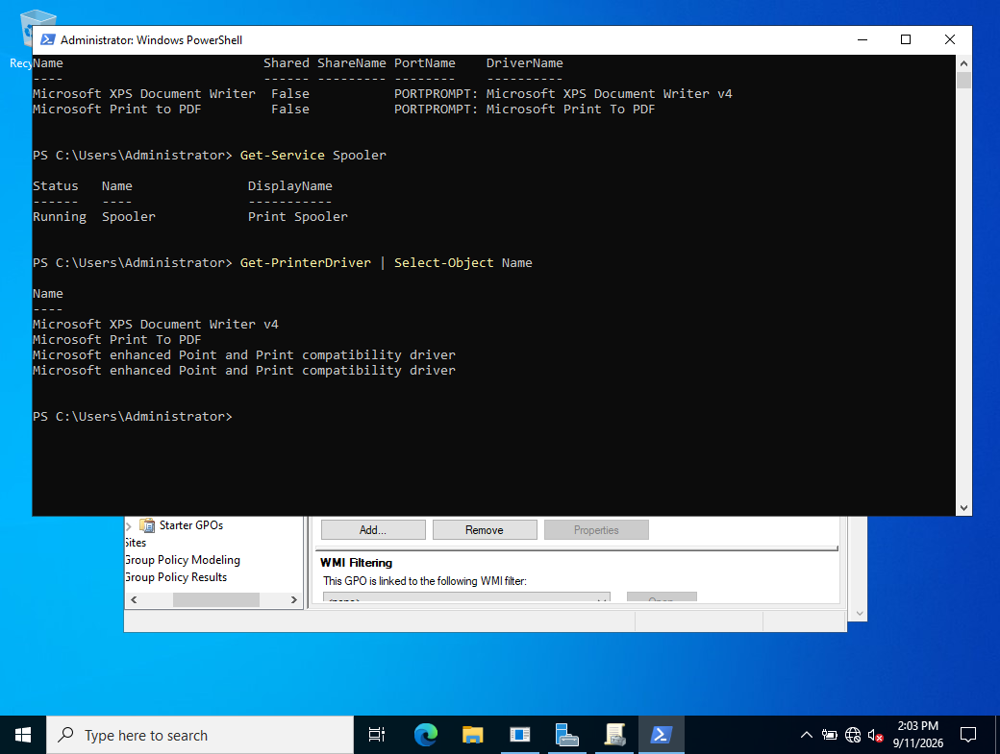
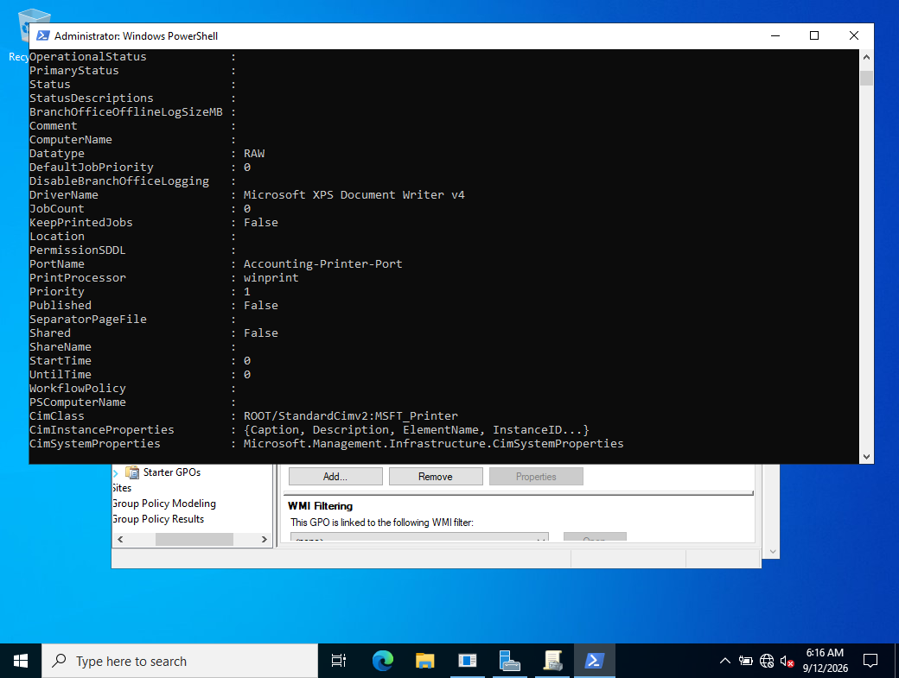
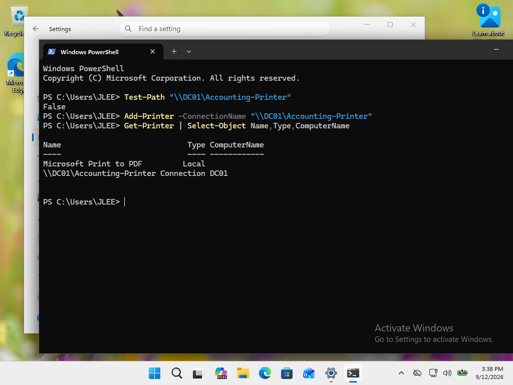
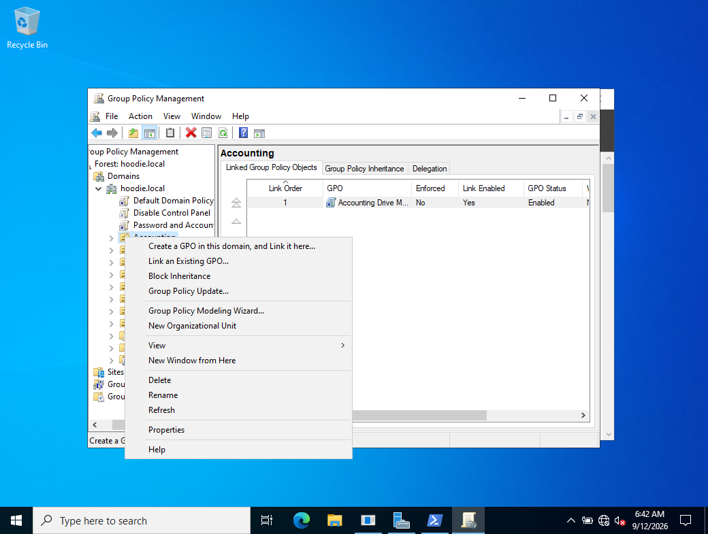

# INC-009 - Accounting Network Printer Deployment

## Ticket Summary

An Accounting user reported that the departmental printer was unavailable on CLIENT01. The workstation initially showed only Microsoft Print to PDF. The incident required investigation of the Windows print infrastructure, creation of a shareable printer queue on DC01, and automated deployment of the printer to Accounting users through Group Policy.

## Environment

- Domain: hoodie.local
- Domain Controller / Print Server: DC01
- Client: CLIENT01
- User tested: Jordan Lee (jlee)
- Department: Accounting
- Printer share: \\DC01\Accounting-Printer
- Printer deployment GPO: Accounting Printer Deployment

## Initial Symptoms

CLIENT01 did not have the expected Accounting printer.

Inspection of DC01 with Get-Printer showed that no Accounting printer queue existed. Only the existing Microsoft virtual printer queues were present.

The Print Spooler service on DC01 was running normally.

## Troubleshooting

The printer inventory on DC01 was reviewed with PowerShell:

    Get-Printer | Select-Object Name,Shared,ShareName,PortName,DriverName

A simulated printer port and queue were created for the lab:

    Add-PrinterPort -Name "Accounting-Printer-Port"
    Add-Printer -Name "Accounting-Printer" -DriverName "Microsoft XPS Document Writer v4" -PortName "Accounting-Printer-Port"

The new queue existed but was not shared.

An attempt was made to share it:

    Set-Printer -Name "Accounting-Printer" -Shared $true -ShareName "Accounting-Printer"

The command failed with HRESULT 0x80070bce.

The Windows Print Server role was checked and found to be available but not installed. It was installed with:

    Install-WindowsFeature Print-Server -IncludeManagementTools

The Print Server role then showed as installed and the Print Spooler remained running.

Retrying Set-Printer produced the same 0x80070bce error. This demonstrated that installing the Print Server role alone did not resolve the sharing problem.

The printer properties in Print Management reported that sharing was not supported for that type of printer. The queue was using the Microsoft XPS Document Writer v4 driver.

Available printer drivers were reviewed. Generic / Text Only was installed through Print Management and verified on DC01.

The simulated Accounting printer queue was rebuilt using the compatible driver:

    Remove-Printer -Name "Accounting-Printer"
    Add-Printer -Name "Accounting-Printer" -DriverName "Generic / Text Only" -PortName "Accounting-Printer-Port"

The printer was then successfully shared:

    Set-Printer -Name "Accounting-Printer" -Shared $true -ShareName "Accounting-Printer"

The shared queue became available as:

    \\DC01\Accounting-Printer

## Direct Client Validation

CLIENT01 successfully connected to the shared printer with:

    Add-Printer -ConnectionName "\\DC01\Accounting-Printer"

Get-Printer confirmed the connection:

    \\DC01\Accounting-Printer    Connection    DC01

A Test-Path result against the printer UNC was not used as an availability test because a shared printer is not a filesystem path.

## Group Policy Deployment

To automate printer deployment for Accounting users, a new GPO was created:

    Accounting Printer Deployment

The GPO was linked to the Accounting OU.

Configuration path:

    User Configuration
      Preferences
        Control Panel Settings
          Printers

A Shared Printer preference was configured with:

    Action: Update
    Share Path: \\DC01\Accounting-Printer

The manually created client printer connection was removed before testing so that Group Policy could be validated independently.

On CLIENT01, Group Policy was refreshed:

    gpupdate /force

The update completed successfully.

Get-Printer then showed:

    \\DC01\Accounting-Printer    Connection    DC01

This confirmed that the shared printer was automatically deployed through Group Policy.

## Root Cause

The expected Accounting printer had not been provisioned or deployed in the lab environment.

During remediation, the initial simulated printer queue used the Microsoft XPS Document Writer v4 driver, which did not support the required printer-sharing configuration. Installing the Print Server role did not resolve that driver limitation.

The queue was rebuilt using the Generic / Text Only driver, successfully shared from DC01, and deployed to Accounting users through Group Policy.

## Resolution

- Verified the Print Spooler service was running.
- Inspected the existing printer inventory and drivers.
- Created a simulated Accounting printer queue.
- Investigated HRESULT 0x80070bce when attempting to share the original queue.
- Installed Windows Print Server management components.
- Determined the XPS-based queue did not support the required sharing configuration.
- Installed and used the Generic / Text Only driver.
- Successfully shared Accounting-Printer from DC01.
- Verified direct client connectivity.
- Created and linked the Accounting Printer Deployment GPO.
- Deployed \\DC01\Accounting-Printer automatically to an Accounting user.
- Verified the resulting printer connection on CLIENT01.

## Validation

The network printer connection appeared on CLIENT01 as:

    \\DC01\Accounting-Printer

with:

    Type: Connection
    ComputerName: DC01

The deployment was subsequently also observed during new-user onboarding in INC-010.

Because this lab uses a simulated printer queue without a physical printer, physical paper output was not tested.

## Skills Demonstrated

- Windows Server print administration
- Print Spooler troubleshooting
- PowerShell printer administration
- Printer ports and queues
- Windows printer drivers
- Shared printer configuration
- Windows Print Server role
- Group Policy Preferences
- OU-based resource deployment
- Client-side Group Policy validation
- Systematic root cause isolation

## Status

Resolved

## Evidence

### 01 - Initial Printer Inventory

DC01 initially contained only the Microsoft XPS Document Writer and Microsoft Print to PDF queues. Neither was shared, and no Accounting printer existed.

### 02 - Print Spooler and Driver Inventory

The Print Spooler service was verified as Running. The available printer drivers were also inventoried, helping rule out a stopped spooler as the cause of the missing printer.

### 03 - Sharing Error and Printer Port Validation

The attempt to share the simulated Accounting printer generated HRESULT 0x80070bce. The Accounting-Printer-Port was separately inspected and confirmed as a local printer port using the Local Monitor.

### 04 - Original XPS Queue Configuration

Inspection of the Accounting printer queue showed that it used the Microsoft XPS Document Writer v4 driver and remained Shared: False. Further investigation determined that this simulated XPS-based queue did not support the required sharing configuration.

### 05 - Direct Client Connection Validation

Jordan Lee successfully connected CLIENT01 directly to:

    \\DC01\Accounting-Printer

Get-Printer confirmed the queue as a Connection hosted by DC01. The Test-Path False result was not treated as a printer connectivity failure because a printer UNC is not a filesystem path.

### 06 - Accounting OU Group Policy Deployment

Group Policy Management was used at the Accounting OU to create and link the printer deployment policy. The completed deployment was later validated from CLIENT01 through Group Policy refresh and printer enumeration.
