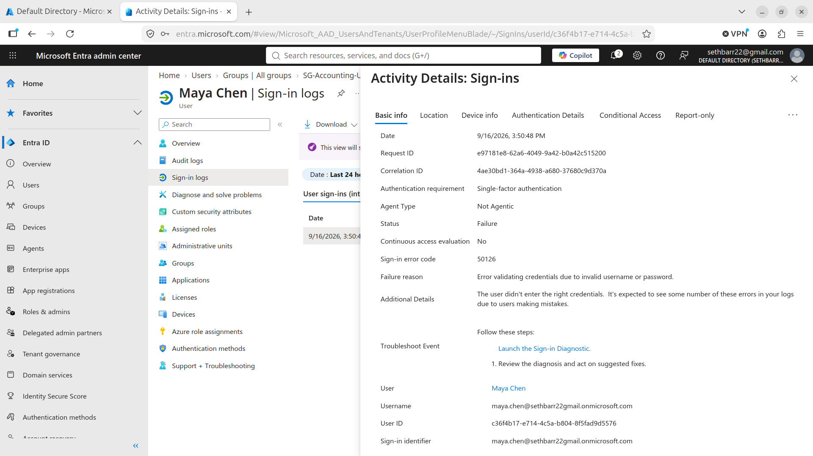
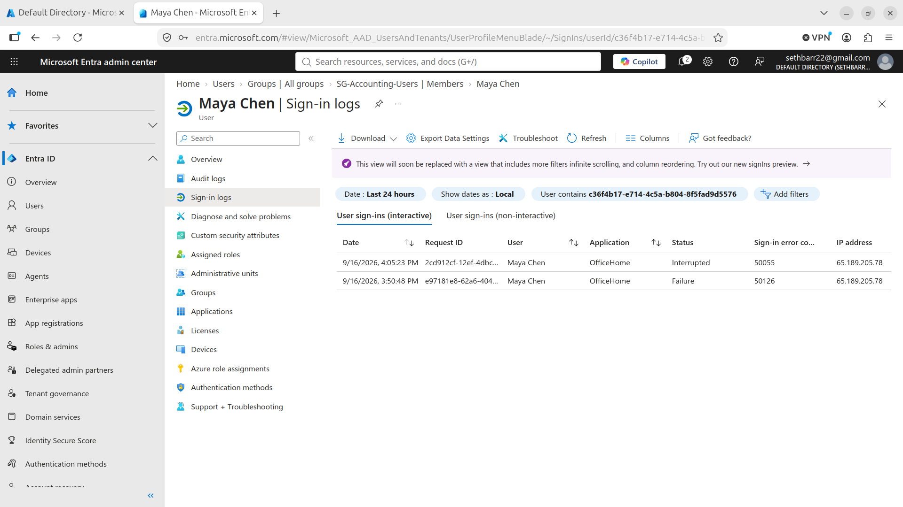
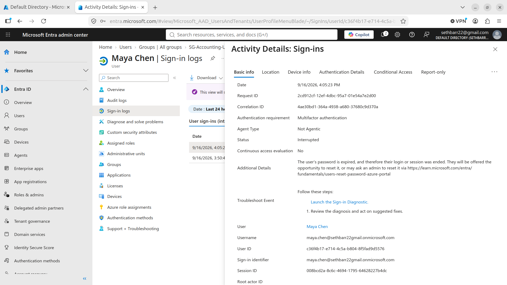
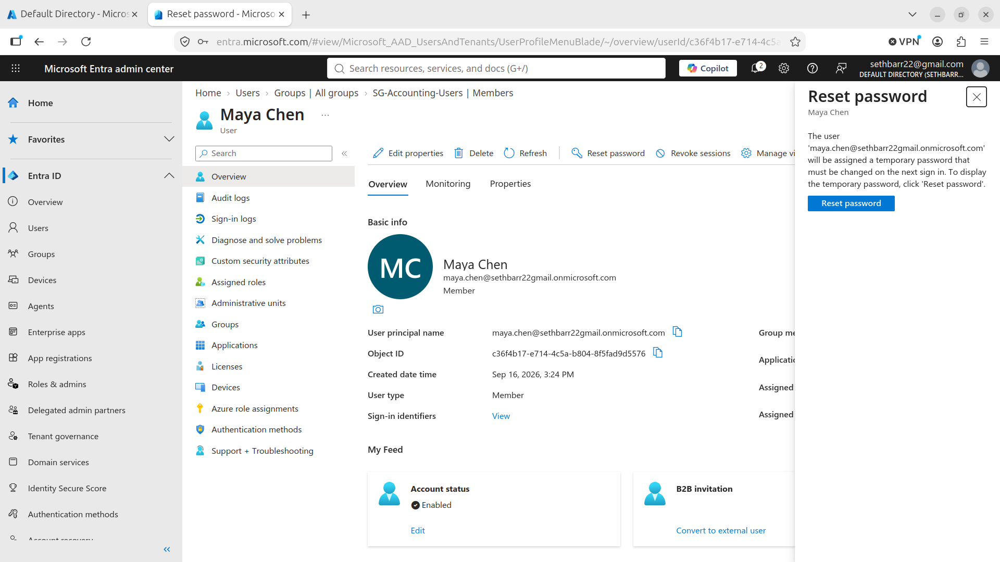
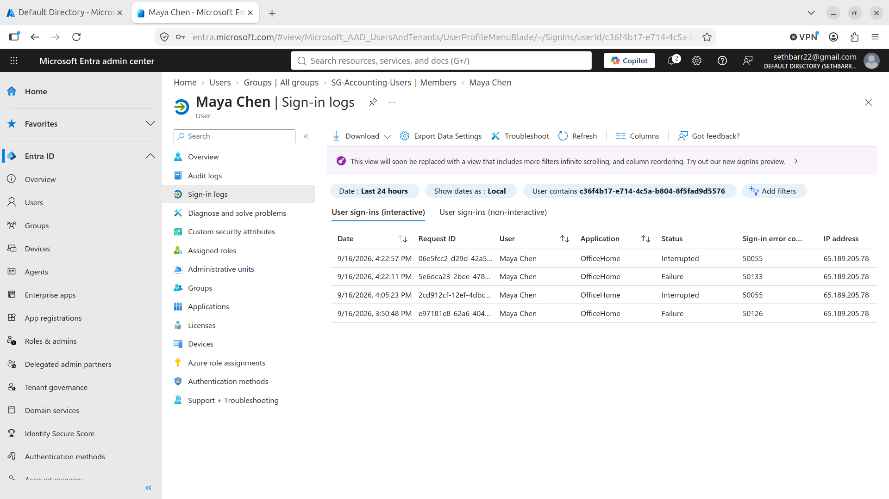
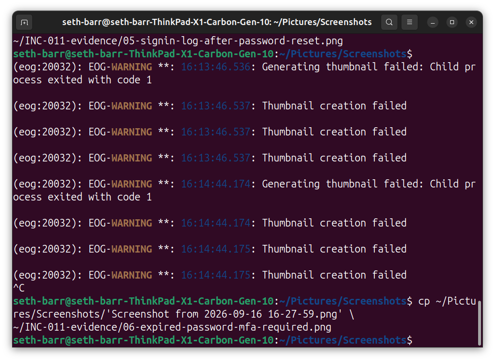
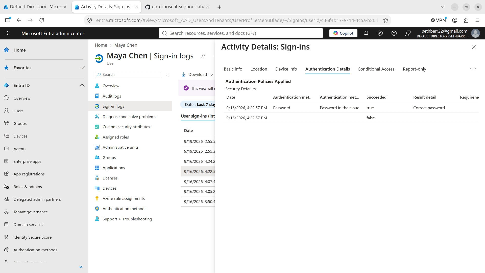
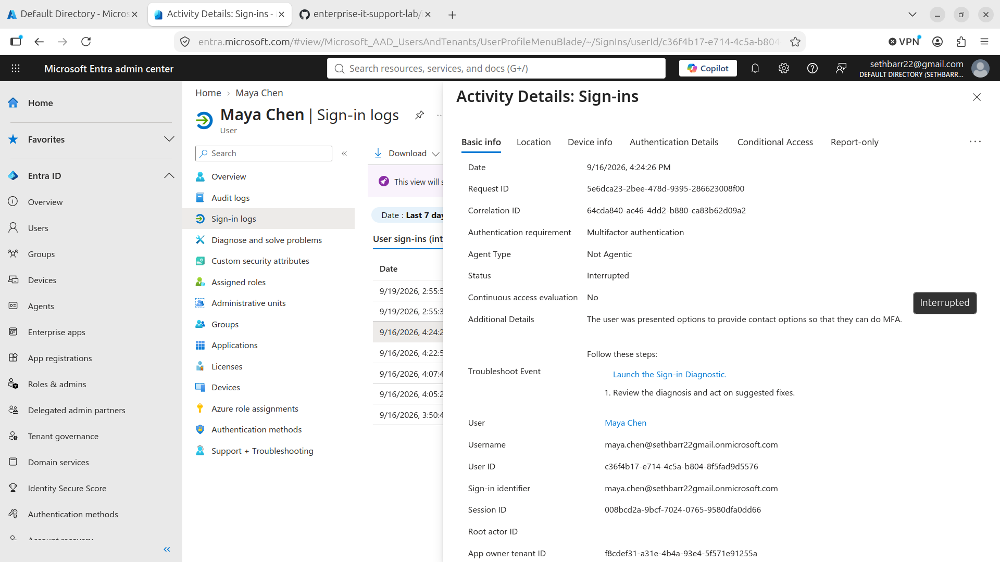

# INC-011 - Microsoft Entra ID Sign-In Failure, Password Reset, and MFA Registration

## Ticket Summary

User Maya Chen reported being unable to successfully sign in to her Microsoft cloud account.

The incident was investigated through Microsoft Entra ID sign-in logs. Initial authentication attempts showed invalid credentials, followed by password-expiration and authentication-registration events.

The account was remediated through an administrator-initiated password reset. Subsequent sign-in activity was reviewed to validate the authentication workflow and eventual successful sign-in.

## Environment

- Microsoft Entra ID
- Microsoft Entra admin center
- Microsoft cloud authentication
- Security Defaults
- Multifactor authentication
- Entra sign-in logs
- Test user: Maya Chen

## Initial Investigation

Microsoft Entra ID sign-in logs were reviewed for the affected user.

An initial failed authentication attempt returned sign-in error code:

50126

The event details identified the failure reason as:

"Error validating credentials due to invalid username or password."

This established that the initial sign-in attempt failed during credential validation.

Evidence:

## Password Change Requirement

Additional sign-in activity showed error code:

50055

The authentication workflow was interrupted because the user's password required a change.

This indicated that credential remediation was required before normal authentication could continue.

Evidence:

## Password Expiration Investigation

The detailed sign-in event was reviewed in Microsoft Entra ID.

The event showed:

- Authentication requirement: Multifactor authentication
- Status: Interrupted
- Additional details indicating that the user's password was expired

The event advised that the user could reset the password or that an administrator could reset it through the Entra administration workflow.

Evidence:

## Administrator Password Reset

The affected user's account was opened in the Microsoft Entra admin center.

An administrator-initiated password reset was performed for Maya Chen.

The reset workflow generated a temporary password requiring the user to change the password during the next applicable sign-in workflow.

Evidence:

## MFA Registration Prompt

During the subsequent authentication workflow, Microsoft prompted the user to strengthen account security by configuring an additional verification method.

The user was presented with the Microsoft Authenticator registration workflow.

This demonstrated that successful credential remediation did not by itself complete the entire authentication process because additional security registration requirements remained.

Evidence:

## Post-Reset Sign-In Review

After the password reset, the user's Entra ID sign-in activity was reviewed again.

The sign-in history showed multiple authentication states during troubleshooting, including interrupted and failed attempts.

These events were used to separate credential-related problems from later authentication and registration requirements.

Evidence:

## Expired Password and MFA Requirement

A detailed authentication event showed:

- Authentication requirement: Multifactor authentication
- Status: Interrupted
- Password expiration information

This confirmed that the authentication workflow involved both credential lifecycle management and multifactor authentication requirements.

Evidence:

## Authentication Details Analysis

The Authentication Details tab was reviewed to determine how far the authentication attempt progressed.

The event showed:

- Security Defaults applied
- Password authentication in the cloud
- Password authentication succeeded
- Additional authentication requirements remained incomplete

This demonstrated that a correct password alone did not necessarily result in a completed sign-in when additional authentication requirements were present.

Evidence:

## MFA Registration Requirement

Another interrupted sign-in event returned error code:

50072

The event details stated that the user was presented with options to provide contact information so that multifactor authentication could be completed.

This identified an additional authentication-registration requirement after the password issue had been addressed.

Evidence:

## Resolution

The incident was investigated through Microsoft Entra ID sign-in telemetry rather than treating each failed sign-in as a generic password problem.

The troubleshooting process identified multiple stages:

1. Initial invalid credential failure
2. Password change or expiration requirement
3. Administrator password reset
4. Multifactor authentication requirement
5. Security information registration requirement
6. Subsequent successful sign-in recorded in Entra ID

The final Entra sign-in history showed a successful interactive sign-in for Maya Chen with sign-in error code 0.

## Validation Summary

User:
    Maya Chen

Initial Sign-In Failure:
    Error 50126 - Invalid username or password

Password Lifecycle:
    Error 50055 - Password change/expiration workflow

Administrative Action:
    Password reset initiated through Microsoft Entra ID

Authentication Requirement:
    Multifactor authentication

Authentication Policy:
    Security Defaults

Additional Registration Event:
    Error 50072 - MFA/security information registration required

Final Validation:
    Successful interactive sign-in recorded in Microsoft Entra ID
    Sign-in error code 0

## Skills Demonstrated

- Microsoft Entra ID administration
- Identity and access management troubleshooting
- Cloud user account support
- Entra sign-in log analysis
- Authentication error-code investigation
- Password lifecycle troubleshooting
- Administrator password reset
- Multifactor authentication troubleshooting
- Security Defaults analysis
- Authentication Details analysis
- Identity incident documentation
- Post-remediation validation

## Status

Resolved
